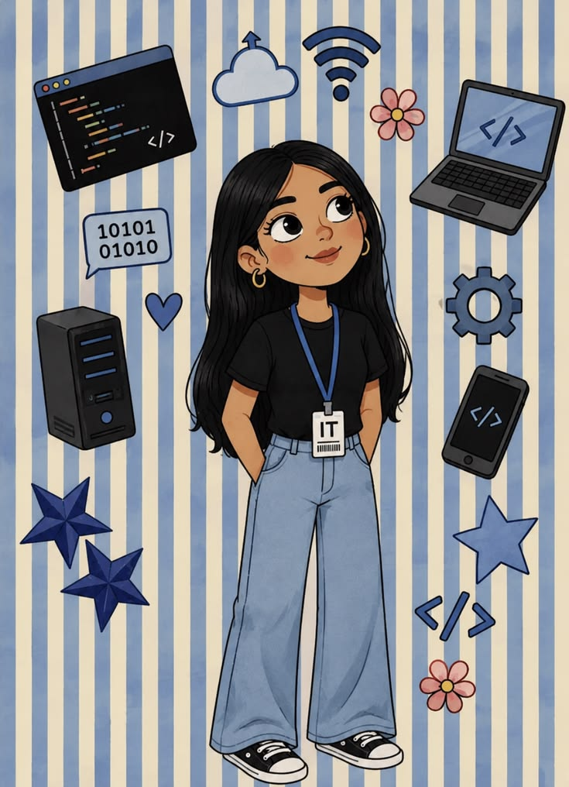

# 👋 Hi, I'm Akhila Gannireddy

### 💜 AI & Data Science Student | Java Programmer

## 🌸 About Me

<table>
<tr>
<td width="65%" valign="top">

- 💻 Passionate about **Software Development**, **Artificial Intelligence**, and **Data Science**
- 🎓 B.Tech CSE (Data Science)
- 🌱 Currently learning **Spring Boot**, **System Design**, and **Machine Learning**
- 🚀 Building real-world applications and strengthening my problem-solving skills through **Data Structures & Algorithms**
- 🎯 Aspiring to become a **Software Engineer / AI Engineer**
- ✨ I believe in learning by building, improving one project at a time.
- 🧩 Fun Fact — I can solve a Rubik's cube in less than 3 minutes!

</td>
<td width="35%" valign="top">

</td>
</tr>
</table>

---

## 💻 Tech Stack

### 👨‍💻 Languages

### 🚀 Frameworks & Libraries

### 🗄️ Database

### 🛠️ Tools & Technologies

---

## 🚀 Featured Projects

| 🌟 Project | 📄 Description |
|:---:|:---|
| 🌾 **PrajaConnect** | A full-stack platform connecting politicians and citizens using React, Spring Boot, and MySQL. |
| 🤖 **AI & Data Science Projects** | A growing collection of Python-based data analysis and machine learning projects. |

---

## 📈 Contribution Graph

---

## 🤝 Let's Connect

**"See you in the next commit 🌸"**

---

